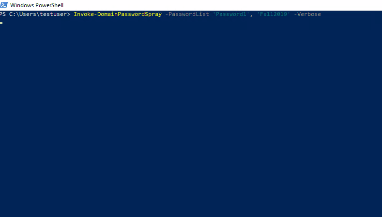

# DomainPasswordSpray

DomainPasswordSpray is a tool written in PowerShell to perform a password spray attack against users of a domain. By default it will automatically generate the userlist from the domain whether a user provides username(s) at runtime or not. If runtime userlist is provided, it will be compared against the auto-generated list and all user-provided usernames that meet the following criteria will be excluded from the final spray list:

- Locked out
- Disabled
- Expired
- Nonexistent
- Within 1 bad password attempt of a lockout

The auth binds for users default to Kerberos over UDP port 88 since default Domain Controller logging doesn't log failed Kerberos auth attempts in the Security eventlog(!). Additionally, it requires fewer packets and the frames are smaller. If 88/udp is unavailable, it then tries 88/tcp. An optional runtime switch is available to use NTLM binding instead, whose failures _do_ show up in the Security eventlog, but whose overall runtime is faster.

This module uses Warren Frame's (@RamblingCookieMonster) Invoke-Parallel to process the users simultaneously in batches of 20 and speed up the spray. In tests, this has reduced scan time by up to 83%. This module has been tested against 9000 users in a production AD environment with a runtime under 60 seconds.

It also uses Steve Syfuhs' (@SteveSyfuhs) Kerberos.NET assembly to handle the kerb auth.

## Quick Start Guide

Minimum PowerShell version: 3

No other modules required (has been coded to preclude the need for the ActiveDirectory module), but it does include a C# assembly compiled into a dll in the ./bin dir.

Open a PowerShell terminal from the Windows command line with 'powershell.exe -exec bypass'.

CD to the DomainPasswordSpray root and:

```PowerShell
Import-Module DomainPasswordSpray
```

The only option necessary to perform a password spray is -PasswordList where you can provide a single string or array of strings. When trying multiptle passwords, Invoke-DomainPasswordSpray will attempt to gather the account lockout observation window from the domain and limit sprays to one per observation window to avoid locking out accounts.

The following command will automatically generate a list of users from the current user's domain and attempt to authenticate using each username and a password of Spring2019.

```PowerShell
Invoke-DomainPasswordSpray -Password 'Spring2019'
```

### Output

Output leaves the function as a PowerShell object. You can therefore pass output down the pipeline to other functions such as Add-Content or other testing tools that make up your toolkit. If writing to a file while spraying with multiple passwords, it is recommend to use Add-Content rather than Out-File. Out-File will wait until the very last password is finished before writing content so an interruption in scanning will leave a blank file with no logged results. Using Add-Content locks the file during use but continually writes to it as objects are received so any disruptions to scanning will leave a file with the results up to that point.

The following command will use the userlist at users.txt and try to authenticate to the domain "domain.local" using each password in the passlist.txt file one at a time. It will automatically attempt to detect the domain's lockout observation window and restrict sprays to one attempt during each window. The results of the spray will be output to a file called sprayed-creds.txt

```PowerShell
Invoke-DomainPasswordSpray -UserName (Get-Content 'c:\users.txt') -DomainName 'domain.local' -Password (Get-Content '.\passlist.txt') | Add-Content 'sprayed-creds.txt'
```

### Invoke-DomainPasswordSpray Options

- UserName          - Optional username parameter. This will be generated automatically if not specified. Can contain single string or array of strings.
- Password          - Mandatory parameter. A list of passwords one per line to use for the password spray.
- DomainName        - Optional parameter. A domain to spray against.
- ShowProgress      - Optional switch. When specified, displays progress bar for user spraying status.
- Ntlm              - Optional switch. When specified, uses Ntlm to bind user creds rather than default Kerberos over UDP port 88.
- Verbose           - Optional switch. When specified, writes status messages out to console.

## Other Examples

While care has been taken to remove dependency on other modules (like ActiveDirectory), you can feed Get-ADUser results to this function:

```PowerShell
Invoke-DomainPasswordSpray -UserName (Get-ADUser -SearchBase "OU=Special,OU=Accounts,DC=domain,DC=local" -Filter * | Select -Expand SamAccountName) -Password 'Fall2019'
```

## Demo



The above gif depicts a parallel spray against 250 users with 2 consecutive passwords, all in 17 seconds.

## Planned Updates

- [x] Take array of strings for UserList & PasswordList params
- [x] Improve progress bar status
- [x] Exclude locked out accounts from the ldap filter
- [x] Use Kerberos auth to avoid default MS logging
- [ ] Introduce throttle/sneaky parameters to reduce login attempts to a certain number within threshold of time (to avoid SIEM rules)

## Contributing

Contributions, fixes, and improvements can be submitted directly against this project as a GitHub issue or pull request.

## License

MIT License

Copyright (c) 2019

Permission is hereby granted, free of charge, to any person obtaining a copy
of this software and associated documentation files (the "Software"), to deal
in the Software without restriction, including without limitation the rights
to use, copy, modify, merge, publish, distribute, sublicense, and/or sell
copies of the Software, and to permit persons to whom the Software is
furnished to do so, subject to the following conditions:

The above copyright notice and this permission notice shall be included in all
copies or substantial portions of the Software.

THE SOFTWARE IS PROVIDED "AS IS", WITHOUT WARRANTY OF ANY KIND, EXPRESS OR
IMPLIED, INCLUDING BUT NOT LIMITED TO THE WARRANTIES OF MERCHANTABILITY,
FITNESS FOR A PARTICULAR PURPOSE AND NONINFRINGEMENT. IN NO EVENT SHALL THE
AUTHORS OR COPYRIGHT HOLDERS BE LIABLE FOR ANY CLAIM, DAMAGES OR OTHER
LIABILITY, WHETHER IN AN ACTION OF CONTRACT, TORT OR OTHERWISE, ARISING FROM,
OUT OF OR IN CONNECTION WITH THE SOFTWARE OR THE USE OR OTHER DEALINGS IN THE
SOFTWARE.

## Acknowledgments

- [dafthack/DomainPasswordSpray](https://github.com/dafthack/DomainPasswordSpray)

- [SteveSyfuhs/Kerberos.NET](https://github.com/SteveSyfuhs/Kerberos.NET)

- [@RamblingCookieMonster](https://github.com/RamblingCookieMonster)

- [@egypt](https://github.com/egypt)
